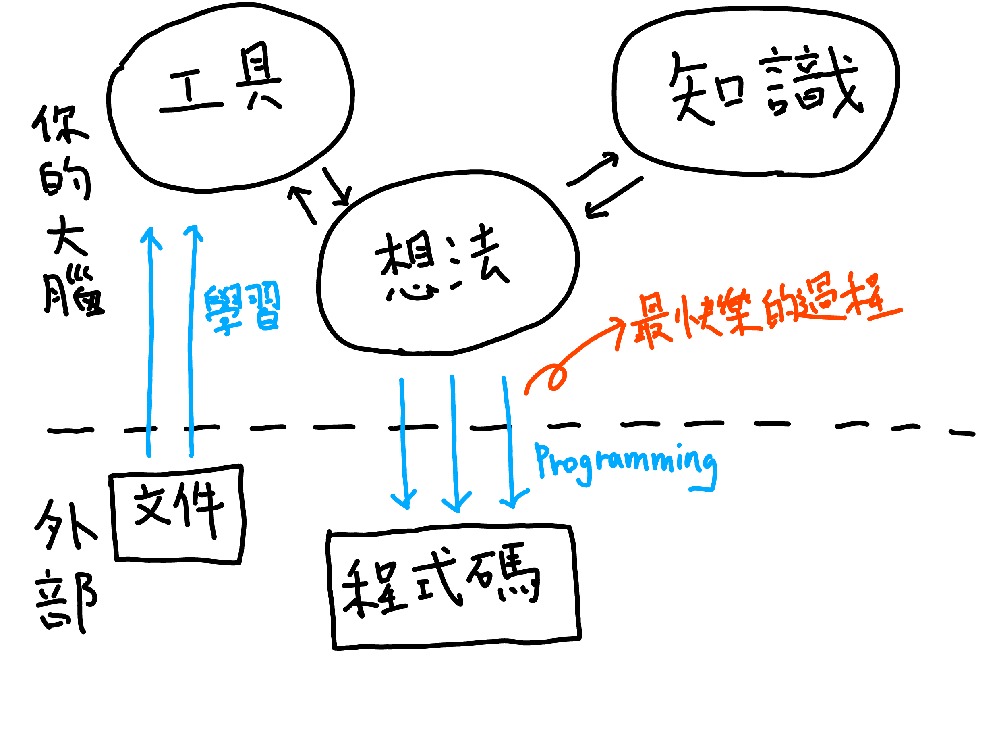
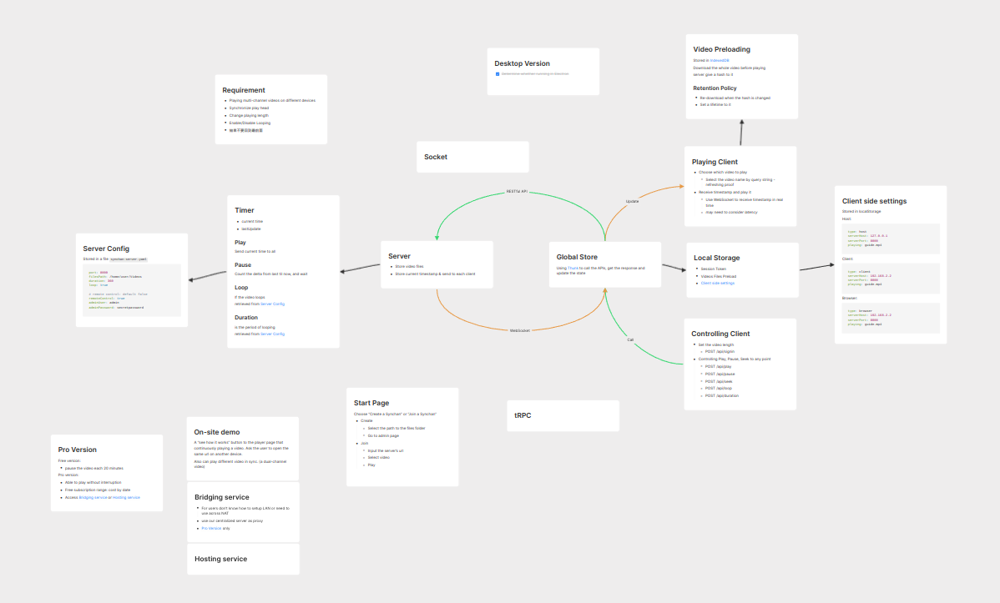

+++
title = '寫程式如何才能真正享受？三個我親身實踐的方法'
date = '2025-03-24T11:26:50+08:00'
draft = false
+++

你有沒有想過，為什麼有些人寫程式充滿樂趣，有些人卻充滿挫折？那些最頂尖的開發者，往往都是對寫程式充滿熱情的人，他們是怎麼做到的？

我自從小六的時候在學校電腦課接觸到了圖像式程式設計工具 Scratch，就此開始了我程式設計的生涯。我一直都很嚮往「創作」，程式設計對我來說有如這個時代的魔法，讓我能實現我的任何想法。

但對我身邊的其他朋友來說，似乎並非如此。程式設計對他們而言是一段充滿挫折的過程，能做出來就不錯了，何談樂趣。在有更多工作經驗後，我也開始體會到，寫程式並非總是令人開心的體驗。那我就開始好奇，到底是怎麼樣的經驗，能讓寫程式變得愉悅？

我們可以從觀察寫程式的經驗開始：

😄 **開心時刻**：

- 程式按預期執行

- 功能成功完成

- 寫出漂亮、乾淨的程式

😣 **痛苦時刻**：

- Debug 很久找不到問題

- 迷失於陌生框架

- 機械式的照本宣科

- 有時間壓力時

## 成就感的來源：實現**你**腦袋中的想法

為什麼學校的程式課那麼無聊？

在學習過程中，我們容易陷入單純的照做教學範本。你沒有自己的想法，那就算實現出來也不會有成就感。

照著別人的指示去做，並不是創作。

寫程式之所以能帶來快樂，最主要就是**「將想法實現」所帶來的滿足感**。寫程式的過程就是**創作**的過程，正如同人們享受畫畫、創作音樂一般。

所以我們應該最大化「將你的想法實踐出來」的過程，並且盡量減少這段過程會遭遇的阻力，就能體驗到最大的快樂與成就感。

對此，我有三點建議，能夠幫助你增加開心的時刻，與減少痛苦的時刻。

1. 將任務分解

2. 在使用前**先熟悉工具**

3. 一次只學習一項概念

## 一、將任務分解

當你開始進行專案，如果在沒有做好構想的情況下就開始寫，也容易會變成不知道現在自己在做什麼，累積了一堆更動都無法 commit 的窘境。

因此我現在在開始寫程式前，會先開始規畫這個系統的架構。我會使用 Heptabase 在白板上先開始設計系統架構、流程圖。我甚至先寫一些虛擬碼，這能使我更早注意到原先沒有考慮到的問題。

接著，我會挑出其中最簡單的部分，開始一件一件實現。你在一個時刻只會聚焦在完成一件小任務，而每當你完成一件任務，你都能感受到一次實現你想法的滿足感。這同時也能避免出現複雜難解的 bug，因為每次的更動的侷限在一個很小的範圍。

然而，「如何將問題有效地拆解成小任務」本身就需要足夠的經驗。如果你發現自己很難進行拆解，可以問問自己：「我是不是還不夠熟悉解決這個問題所需的工具與概念呢？」這時，就會進入第二個重點：

## 二、在使用前先熟悉工具

不知道你有沒有過這樣的經驗：要開始使用一個新的框架，但是沒寫幾行程式，就得要一直去查文件，後來甚至發現你設計的架構和框架不合要重做。

學習和寫程式，一個是輸入，另一個是輸出。我們無法邊吸氣邊唱歌，我們也無法在邊學習工具邊使用它。

我在一部[志祺訪談軟體工程師的影片](https://www.youtube.com/watch?v=_XRj9aYbOP0)中看到了對寫程式時的心境非常生動的比喻：

> 寫程式時就像是在潛水。越困難的問題，你就需要花時間潛到很深的地方去尋找解法。一旦中間被打斷，你就得浮到水面上，再重新潛下去。

因此，當你發現花了超過 80% 的時間都是在學習怎麼使用工具，而非寫出你要的功能時，你應該先放下手上的專案，開一個新工作區，熟悉一下你需要使用的工具。可以是走一遍網站上的 Quick Start、Example，或是把你的專案要用的功能先操作一遍。

在我們寫專案的過程中，環境往往是複雜的。有時你很難確認問題到底出在你的程式邏輯，還是工具與你預期的不同。透過一個獨立的新環境，單純測試工具的功能，能驗證你對工具的了解，並減少未來除錯的表面積。

更重要的是，在熟悉工具後，它們才會「進入你的腦袋」變成你思考的一部分。利用它們開發程式，才會讓人享受。

## 三、一次只學一個概念

正如同我們要在使用前先熟悉工具，一個專案牽涉的概念（或是所謂領域知識 domain knowledge）則是思維的工具。當寫程式的過程有太多你不熟悉的概念，你最好先停一下，一步步熟悉各自的概念之後，再開始開發。

舉我女朋友學習程式的例子：初學者該學習什麼語言，最常見的說法是 Python，但實際還是要看對方有沒有一些具體需求。我當時認為 JavaScript 作為現在幾乎無所不能的語言，其動態型別也有較低的門檻，學習過程還可以製作互動網頁等專案，有比較高的成就感，同時在業界也有很多職缺，應該會是個好選項。因此我們選擇從一個零基礎的網頁全端線上課作為起點。

但她在上了一陣子後發現，網頁全端這個領域有太多概念，光是前端就有三種語言 HTML、CSS、JavaScript，後端的 NodeJS 和瀏覽器的執行環境又有所不同，後端處理請求又有 routing, middleware, template 等不同概念。我這時才理解到，在沒有計算機與網路的基礎下，是幾乎沒有辦法理解這整套架構的。

回顧我的程式學習歷程，我也從來不是像這樣一次被灌輸整個全端開發的所有知識，而是每個階段都只專注在一個概念：用 Scratch 學邏輯和遊戲設計，用 Python 學習程式語言與網路協定，用 Go 學習後端系統開發，用 JavaScript 學習前端開發。

當你一次要掌握太多不同的概念，就會造成認知負擔，沒有辦法好好的運用他們去實現你的想法。

所以一次聚焦一樣目標，如果你要從零開始學習寫程式，就從 Python 開始吧！等你掌握了「寫程式」這件事，學習別的應用才會順利許多。

---

將任務分解、在使用前**先熟悉工具**、限制一次需要學習的概念數量，這三個方法，不論你是什麼階段的開發者，都能夠受用，讓你更享受寫程式的過程。

有經驗的開發者，就是累積了大量使用工具的經驗，與不同的領域知識，使得他們能夠活用這些知識與經驗，去解決眼前的問題。

不論你現在正處於學習階段，還是已經有一定經驗，希望這三個方法能幫助你享受程式設計的美好時光，一起在創作中獲得更多樂趣！
