+++
title = '實戰 Ubuntu Server 安裝'
date = '2023-02-03T09:43:34+08:00'
draft = false
+++

哈囉大家好，歡迎收看 indieveloper 獨立開發者，我是林貓，今天要手把手帶你安裝 Ubuntu Server 在你的舊電腦上。這部影片同時會搭配一個文章版，在資訊欄可以找到連結喔！

今天的教學會分為 5 個步驟：

1. 下載 ISO
2. 製作開機 USB
3. 開機設定
4. 安裝 OS
5. 測試 SSH 登入

你需要準備：

* 一台用來操作的電腦
* 一台用來安裝的電腦（會清空所有資料）
* 一個 USB（會清空所有資料）
* 兩台電腦能同時使用一個網路（以太網路、WiFi）

準備好的話，我們就開始吧！

## 下載 ISO

ISO 檔你可以想像是把一個硬碟封裝在一個檔案裡，裡面包含了一整個作業系統，我們開機時選用灌入這個 ISO 檔的 USB，就能夠進入 Ubuntu 的安裝程序了。

首先，我們到 [ubuntu](https://ubuntu.com/download/server) 官網下載 ISO 檔，我們選擇 Server 版本，下載 Ubuntu Server 22.04 LTS 長期支援版。


## 製作開機 USB

因為 ISO 目前是存在我們電腦的硬體裡，沒辦法直接拿來開機，因此我們要將 ISO 放到 USB 中，我會使用的燒錄程式是 [Ventoy](https://ventoy.net)，Ventoy 可以讓你在一個 USB 存入多個 ISO 檔，完整利用你的儲存空間，方便你試用不同的發行版。到 [Ventoy 下載頁面](https://github.com/ventoy/Ventoy/releases)，選擇你**正在使用的作業系統**下載。

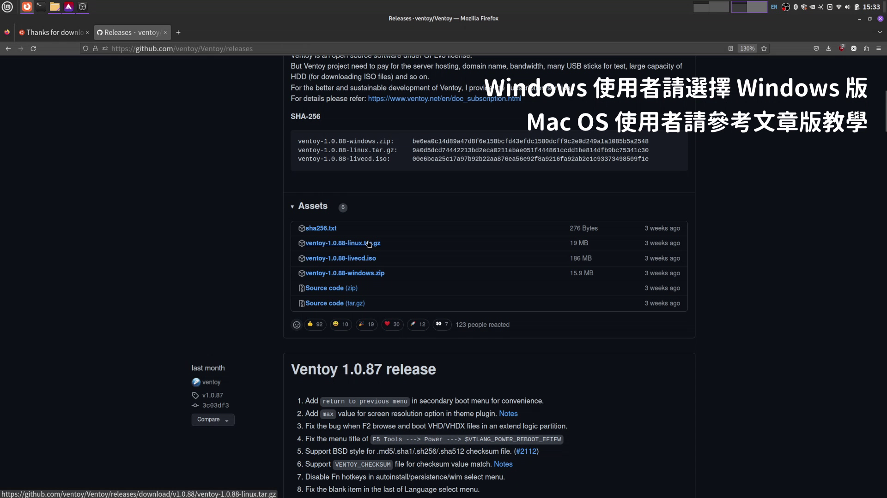

插入你的 USB，解壓縮後執行 Ventoy2Disk，選擇你的 USB 裝置（**注意不要選到你的硬碟！**），按 Install。

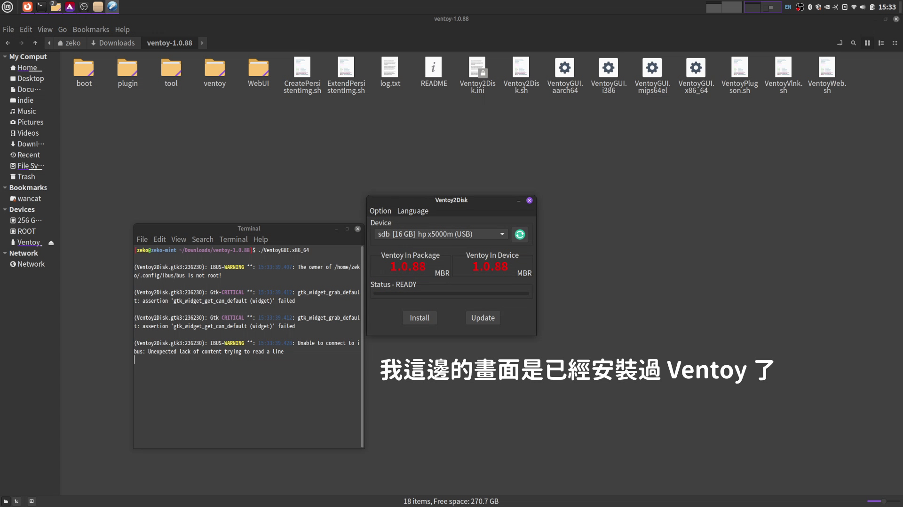

接著從你的檔案管理員，打開這個 USB（它應該會叫作 Ventoy），把剛剛下載的 ISO 檔複製到 USB 裡，完成後請一定要按退出，不然可能會沒寫入成功。這樣子我們就完成開機 USB 了。（圖片中有很多 ISO 檔是我其他時候存的）

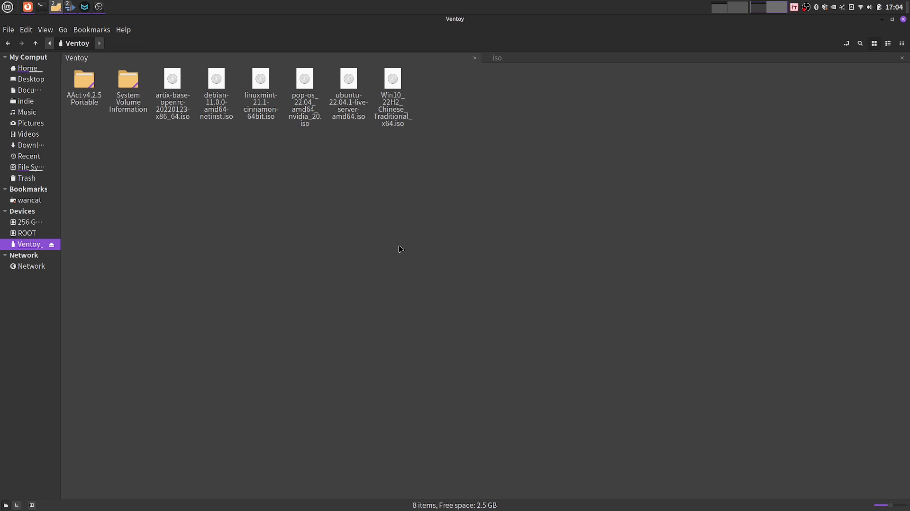

## 開機設定

接著我們將 USB 插入到要拿來當伺服器的電腦，按下開機，在開機時會有一個很快的畫面，上面會告訴你選擇開機裝置的快捷鍵，在我這台電腦上是 F12。

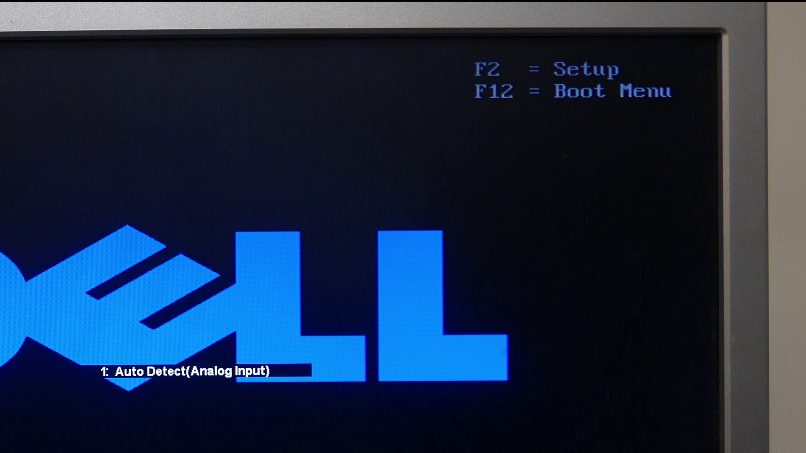

請快速的按這個快捷鍵（可以多按幾下），就會打開一個開機選單，選擇你的 USB 按 Enter 開機。接著就會進到 Ventoy 的畫面，裡面會列出所有在你 USB 中的 ISO 檔，選擇 Ubuntu Server 按 Enter。

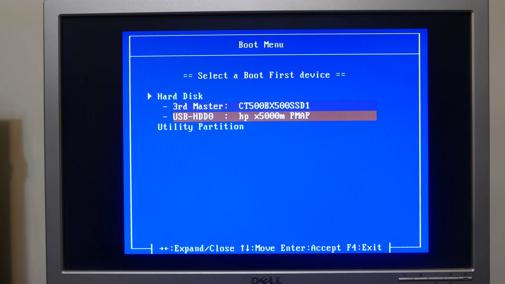

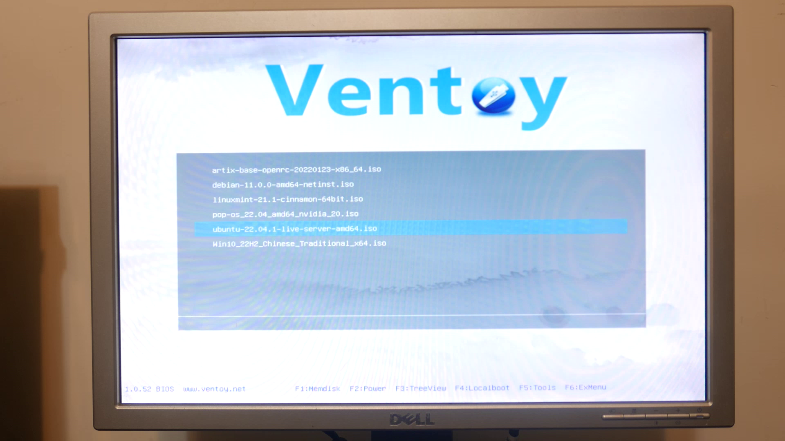

## 安裝 OS

接著我們要開始作業系統的安裝，為了讓你能看得更清楚，我會改用虛擬機的安裝畫面。首先要選擇語言，我們用 English，它問你要不要更新安裝程序，我們選不要，鍵盤佈局保留預設，安裝選項保留預設。

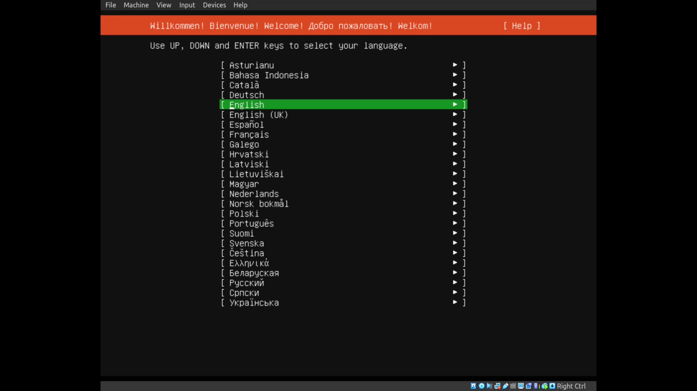

### 設定網路

設定網路這裡如果你是用以太網路，那它就會自動連線了，這邊我建議你可以先設定一個靜態 IP，讓你之後要連線到伺服器有個固定的位址。

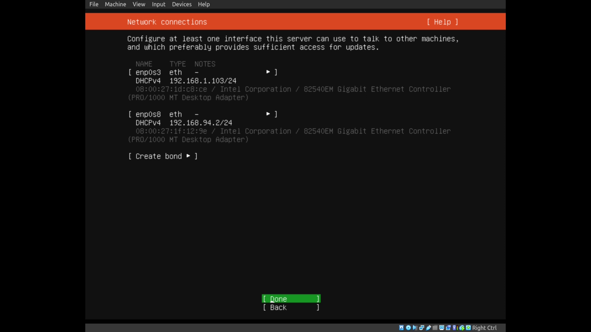

請看它給你的 IP 地址，以我的為例：`192.168.1.103/24`，這邊 `/` 前面的 `192.168.1.103` 是你的 IP 地址，而後面的 `24` 則是子網路遮罩，代表前 24 位元是你的網路位址（一個 IP 有 32 位元，前 24 位元就是前 3 個數字），也就是 `192.168.1`，請記下這個網路位址。

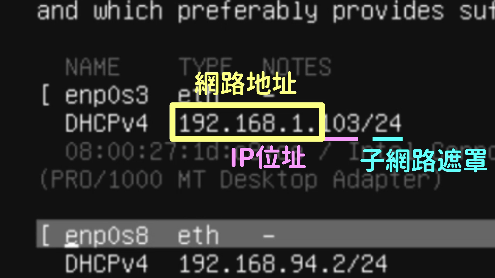

接著我們 Edit IPv4，選擇手動 Manual，在 Subnet 填入 `[你剛剛的網路位址].0/[子網路遮罩]`，以我的為例就是 `192.168.1.0/24`，在 Address 填入在你的網路位址底下一個沒有人用、好記的 IP，在這裡我用 `192.168.1.10`。Gateway 在一般家用伺服器多半就是 `[網路位址].1`，以我為例是 `192.168.1.1`，DNS 伺服器我習慣使用 Cloudflare `1.1.1.1,1.0.0.1`。Search Domain 這欄我們先留空。點擊 OK 完成。

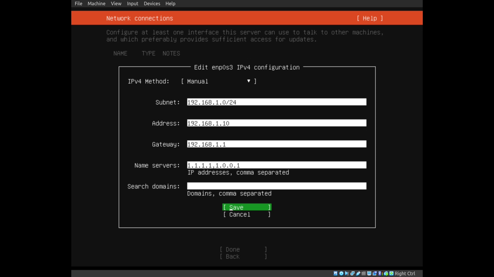

代理伺服器留空，鏡像伺服器保持預設。

### 硬碟分割

接著進到硬碟分割，我預設你這邊只使用一顆硬碟，如果你有多顆硬碟，請參考這邊的教學。我們選擇 `Use an entire disk`，並取消勾選 `Set up this disk as an LVM group`，LVM 是一個邏輯分割硬碟的系統，但有些複雜，因此除非你知道你在做什麼，否則我們先取消它。

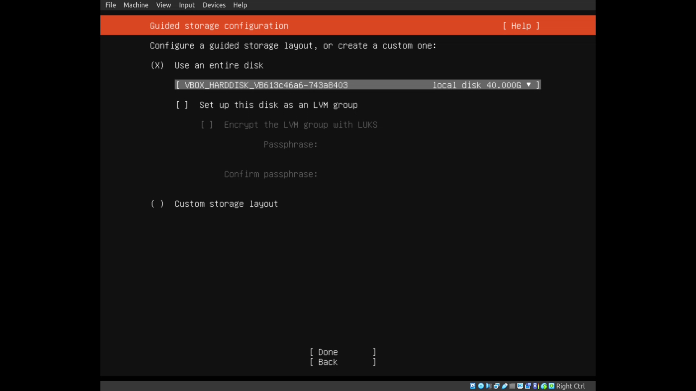

最後進入確認，你硬碟上原有的所有資料都會被刪除，請確保你有備份重要資料。

接下來設定你的使用者名稱，主機名稱（在未來可以修改），選擇你的 username，這邊要全部英文小寫，設定一個密碼，請儘量使用高強度密碼。

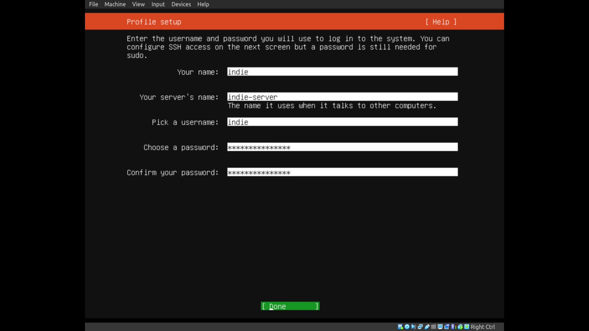

再來要勾選 `Install OpenSSH Server`，我們才能從別台電腦連線上來操作。`Import SSH indentity` 跳過。


接下來可以選你要裝哪些 Snap 軟體，全部留空按 Done，我們就會開始安裝。

等待安裝完成，點擊 `Reboot Now`，等待出現 `Please remove the installation medium, then press ENTER:`，拔掉 USB，按 Enter，完成重開機，我們的安裝就完成了。


## 測試 SSH 登入

接著我們要從別台電腦連入伺服器，打開你的終端機（在 Windows 上叫作 cmd），輸入：

```
ssh [你的使用者名稱]@[你的伺服器 IP]
```

以我為例，就是

```
ssh indie@192.168.1.10
```

輸入密碼後就能夠登入到伺服器中。

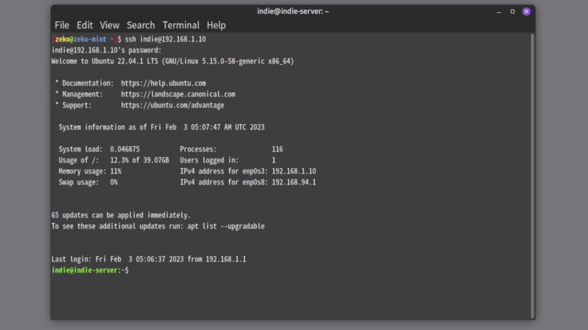

---

以上就是今天的 Ubuntu Server 安裝教學，如果你在安裝時有任何問題，歡迎到我們的論壇提問。如果這樣的影片有幫助到你，歡迎到我們的官網 indie.tw，訂閱我們的電子報，讓你不受演算法控制，掌握自由最新情報。我們下集見！
